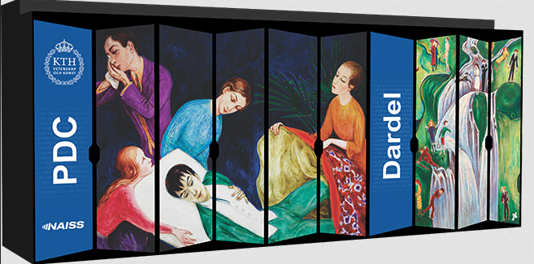
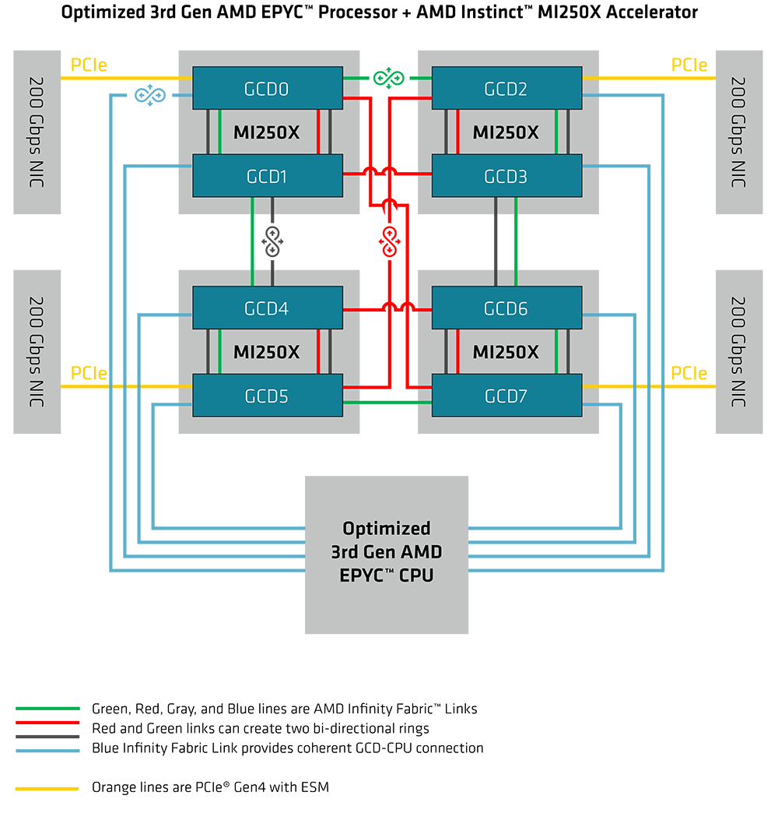
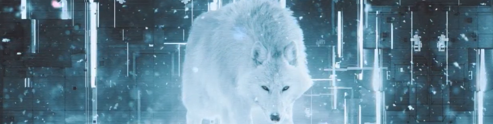
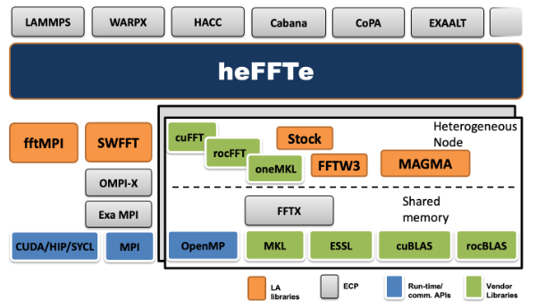
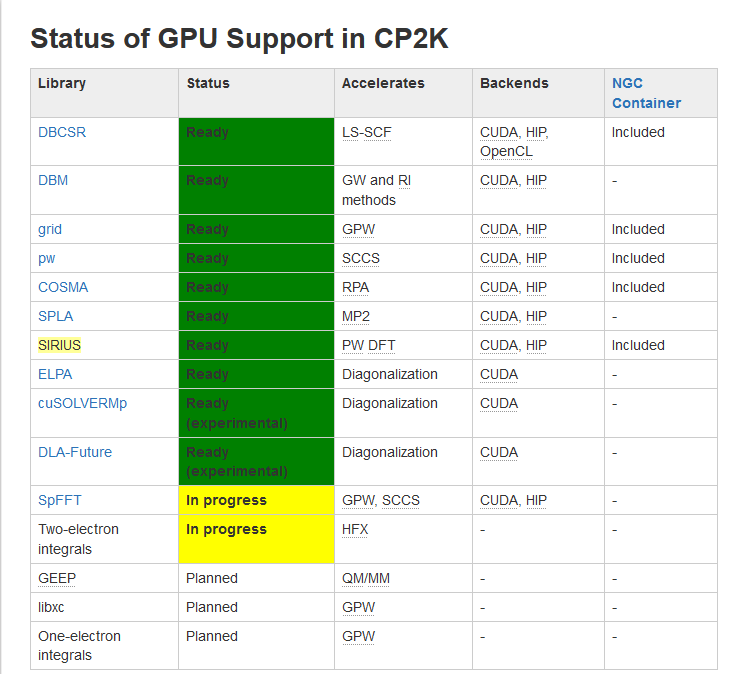
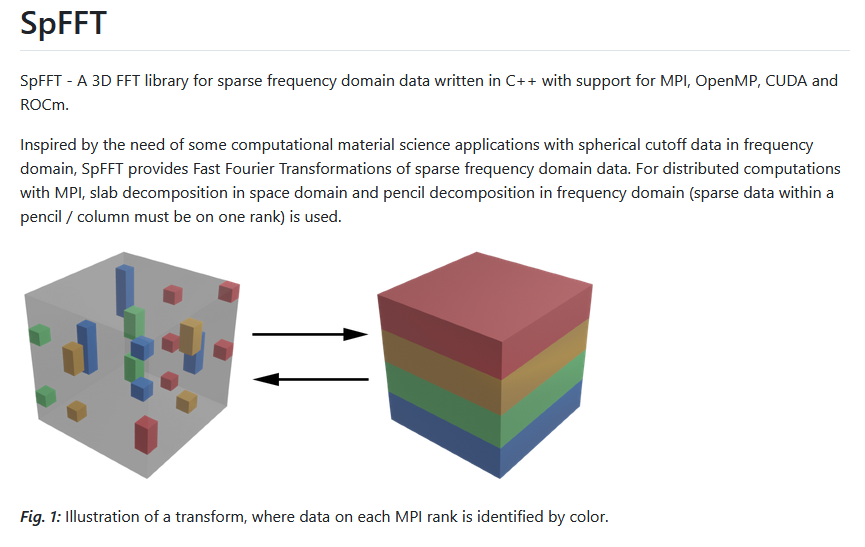
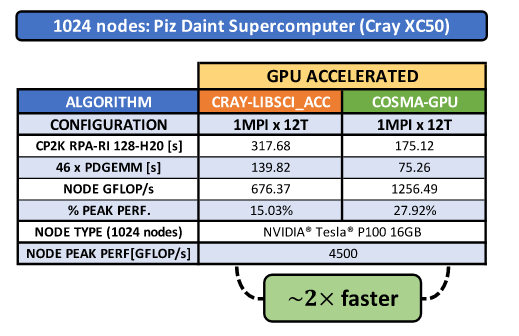
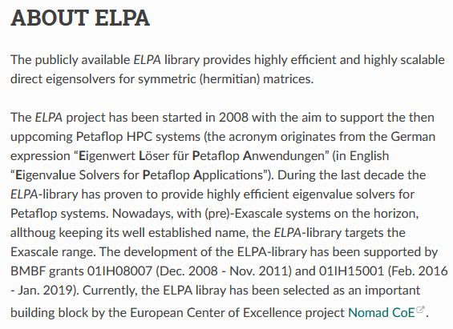
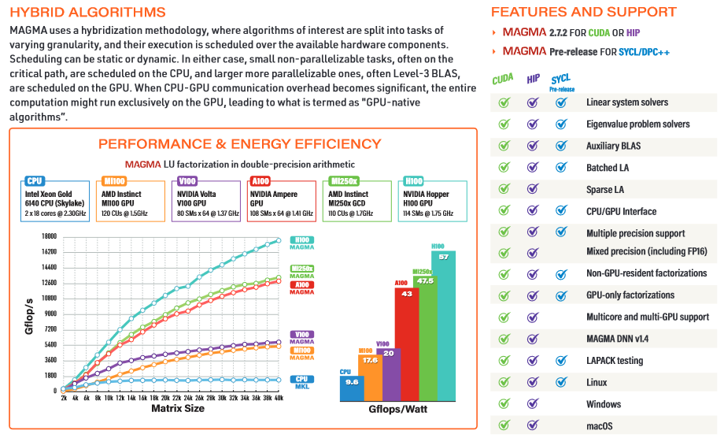

<!-- paginate: true -->

# Materials theory codes on Dardel and LUMI
## Johan Hellsvik
### PDC Center for High Performance Computing, KTH Royal Institute of Technology, Sweden

Uppsala, 31 May, 2024

---

# High performance computing for magnetism

## Types of computer codes used in magnetism research
  - Density functional theory programs (often with DMFT, GW, hybrid functionals)
  - Atomistic modeling magnetic systems: Monte Carlo simulations of spin Hamiltonians, atomistic spin-dynamics simulations, and spin-lattice dynamics simulations
  - Micromagnetic modeling
  - Computer assisted (linear) spin wave theory
  - Programs for analyzes of experimental data
  - ... and other methods

---

# Density functional theory codes

## Challenges
  - Often large complex codes. Difficult to grasp for individual developers and users
  - High memory demand, scaling to different order with number of atoms/electrons/orbitals, plane wave cut-off, angular momentum cut-off, etc
  - High memory bandwidth demand, for instance for large Fourier transforms

## Strategies
  - Make use of optimized CPU/GPU libraries
  - Modularization of code - enabling for multiple backends
  - Develop algorithms with scaled down memory bandwidth demand

---

# Atomistic spin dynamic codes

### Challenges and opportunities
  - Lattice models in which (mainly) short-range interactions are used. Naturally memory local
  - Compute load per time step and sub-volume is small. Data exchange between sub-volumes need to happen often.
  - Compute load mainly custom arithmetics, rather than on library calls.

### UppASD GPU porting project (2023 - )
  - Aims to develop and implement state-of-the-art algorithms and backends for ASD
  - Team: Johan Hellsvik, Mariia Mohylna, Arkadijs Slobodkins, Anders Bergman, Danny Thonig, Manuel Pereiro, Anna Delin, Olle Eriksson

---

# The Dardel supercomputer

- Named after the author Thora Dardel. Paintings on the cabinet walls by Nils Dardel

- Dardel is operated by the PDC Center of High Performance Computing, KTH, and is a part of NAISS



---

# Dardel is an HPE Cray EX system

### A heterogeneous supercomputer architecture

### CPU partition

    - 1270 CPU nodes
    - Each node has
        + two AMD EPYC™ Zen2 2.25 GHz 64-core processors

### GPU partition

    - 56 GPU nodes
    - Each node has
        + one AMD EPYC™ processor with 64 cores
        + four AMD Instinct™ MI250X GPUs

---

# Dardel GPU nodes

Dardel GPU nodes are each equipped with

- 1 AMD EPYC™ processor with 64 cores

- 512 GB of shared fast HBM2E memory

- 4 AMD Instinct™ MI250X GPUs
  - up to 95.7 TFLOPS in double precision when using special matrix operations



---

# The LUMI supercomputer

- A larger sibling to Dardel

- LUMI is hosted by the LUMI (Large Unified Modern Infrastructure) consortium

- Located in CSC’s data center in Kajaani, Finland


---

# Generalized programming for GPUs

Central processing units (CPU) and graphics processing units (GPU) do different work

- CPUs have large instruction sets and execute general code.

- GPUs have smaller instructions sets. Run compute intensive work in parallel on large number of compute units (CU).

- Code execution is started and controlled from the CPU. Compute intensive work is offloaded to the GPU.

---

# AMD Radeon Open Compute (ROCm)

The AMD Radeon Open Compute (ROCm) platform is a software stack for programming and running of programs on GPUs.

- The ROCm platform supports different programming models
    - Heterogeneous interface for portability (HIP)
    - Offloading to GPU with OpenMP directives
    - The SYCL programming model

---

# Mathematical libraries

Early in the field of scientific computing, it was realized that many programs have in common that they involve a a number of often used arithmetic operations. For instance

- Summation and multiplication of matrices and vectors
- Discrete Fourier Transforms
- Eigenvalue solvers

Implementations to computer code of different mathematical operations got packaged into reusable pieces of code, so called libraries, that can be called from individual application programs.

---

# Requirements on mathematical libraries

Requirements and desired properties for libraries are

- Accuracy and stability
  - code need to be of high quality, well tested, and documented

- Transferability and flexibility
  - to different computer architectures
  - to different use cases: e.g. dense or sparse matrices

- Performance
  - time to solution
  - efficiency and power consumption

 ---

# Transferability and flexibility: example FFT

Most implementations of the Discrete Fourier Transforms are based on the so called Fast Fourier Transform algorithm

- Dimensionality of the transform: 1D, 2D, or 3D?
- Size of the data? For 3D FFTs, 4096^3 is a large computation
- Density of the data: Is the data set in the frequency domain dominated by a few frequencies or a broad range of frequencies?
- Backends for different CPUs and GPUs

## Taken together, the large set of requirements are difficult to fulfill in a single implementation of FFT.

---

## Example: heFFTe - Highly Efficient FFTs for Exascale

### Screenshot from
##### https://icl.utk.edu/files/print/2023/heffte-sc23.pdf



---

## Transferability from point of view of application developers

In analogue to the requirements on libraries, application program needs to be transferable

- To different use cases. Specific or more general. Compare
  - 1 student, 1 code, 1 project
  - 1 team, 1 more general code, multiple projects

- To different hardware and stacks of libraries
  - Strive to avoid lock-in to e.g. only Intel Xeon CPUs or Nvidia GPUs

### Strategy: Develop codes with intended longer life time. Choose libraries that support multiple backends

---

# Example: The open source program CP2K

- A quantum chemistry and solid state physics software package
- Can perform atomistic simulations of solid state, liquid, molecular, periodic, material, crystal, and biological systems
- Written in Fortran 2008. Combines parallelization with MPI, OpenMP threading, and GPU backends with CUDA (Nvidia) and HIP (AMD).
- Backed by the CP2K Foundation, an association founded in Zürich in 2015: *"The purpose of the CP2K Foundation is to promote the CP2K software project and to protect its open nature"*
- Utilizes libraries, developed at ETHZ and elsewhere, for heterogeneous computing.

---

# Status of GPU support in CP2K

### Screenshot from
##### https://www.cp2k.org/gpu



---

# SpFFT - A 3D FFT library for sparse frequency domain data

### Screenshot from
##### https://github.com/eth-cscs/SpFFT



---

# COSMA - Communication-Optimal Matrix-Multiplication

### Screenshot from
##### https://github.com/eth-cscs/COSMA



---

# ELPA - Eigenwert Löser für Petaflop Anwendungen

### Screenshot from
##### https://elpa.mpcdf.mpg.de/ABOUT_ELPA.html



---

## MAGMA - Matrix Algebra on GPU and Multi-core Architectures

#### Designed and implemented by the team that developed LAPACK and ScaLAPACK

### Screenshot from
##### https://icl.utk.edu/files/print/2023/magma-sc23.pdf


---

# DFT codes available on Dardel (selected)

- [The Relativistic Spin Polarized tookit (RSPt)](https://www.pdc.kth.se/software/software/RSPt/index_general.html), a code for electronic structure calculations based on the Full-Potential Linear Muffin-Tin Orbital (FP-LMTO) method.

- The [Quantum ESPRESSO](https://www.pdc.kth.se/software/software/Quantum-ESPRESSO/index_general.html) integrated suite of open-source computer codes for electronic-structure calculations and materials modeling at the nanoscale

- [CP2K](https://www.pdc.kth.se/software/software/cp2k/index_general.html), a program to perform ato1mistic and molecular simulations of solid state, liquid, molecular, and biological systems.

---

## ABINIT

- General purpose program for electronic structure calculations and quantum-mechanical molecular dynamics, from first principles, using pseudopotentials and a planewave or wavelet basis. Example ABINIT job script

```
#!/bin/bash
#SBATCH -A <your-project-account>
#SBATCH -J abinit-job
#SBATCH -p main
#SBATCH -t 04:00:00
#SBATCH -N 1
#SBATCH --ntasks-per-node=128
ml PDC/23.12
ml abinit/10.0.5-cpeGNU-23.12
export ABI_PSPDIR=<pseudo potentials directory>
srun -n 128 abinit <input file>.abi > out.log
```

Reference page: [General information about ABINIT](https://www.pdc.kth.se/software/software/ABINIT/index_general.html)

---

## Elk

- Elk is an all-electron full-potential linearised augmented-planewave (FP-LAPW) code. Example job script for a hybrid MPI and OpenMP Elk calculation on Dardel

```
#!/bin/bash
#SBATCH -A <project name>
#SBATCH -J myjob
#SBATCH -p main
#SBATCH -t 10:00:00
#SBATCH --nodes=1
#SBATCH --ntasks-per-node=16
#SBATCH --cpus-per-task=16
ml PDC/23.12 elk/9.5.14-cpeGNU-23.12
export SRUN_CPUS_PER_TASK=$SLURM_CPUS_PER_TASK
export OMP_NUM_THREADS=8
export OMP_PLACES=cores
export OMP_PROC_BIND=false
export OMP_STACKSIZE=256M
ulimit -Ss unlimited
srun -n 16 elk > out.log
```

Reference page: [General information about Elk](https://www.pdc.kth.se/software/software/Elk/index_general.html)


---

## How to build Elk

- For maintaining and installing (new versions) of materials theory codes on Dardel, we are mainly using the EasyBuild system. To build Elk 9.5.14 under CPE 23.12, load and launch an EasyBuild with

```
ml PDC/23.12 easybuild-user/4.9.1
eb elk-9.5.14-cpeGNU-23.12.eb --robot
```

- A program that has been EasyBuilt and installed on Dardel can (often) be straightforwardly ported to a build configuration for LUMI. Or vice versa, a build on LUMI can be ported for Dardel. The easyconfig build configuration for Elk on Dardel has been ported to LUMI. See and compare the easyconfigs

  - Dardel [elk-9.5.14-cpeGNU-23.03.eb](https://github.com/PDC-support/PDC-SoftwareStack/blob/master/easybuild/easyconfigs/e/elk-9.5.14-cpeGNU-23.03.eb)
  - LUMI [Elk-8.7.10-cpeGNU-22.12.eb](https://github.com/Lumi-supercomputer/LUMI-EasyBuild-contrib/blob/main/easybuild/easyconfigs/e/Elk/Elk-8.7.10-cpeGNU-22.12.eb)

Reference: [Installing software using EasyBuild on Dardel](https://www.pdc.kth.se/support/documents/software_development/easybuild.html)

---

### Path for installation, generated make.inc file

- Where is the program installed?

```
~/.local/easybuild/software/elk/9.5.14-cpeGNU-23.12
```
- Inspect the ``make.inc``

```
cat ~/.local/easybuild/software/elk/9.5.14-cpeGNU-23.12/make.inc

MAKE = make
AR = ar
SRC_MKL = mkl_stub.f90
SRC_OBLAS = oblas_stub.f90
SRC_BLIS = blis_stub.f90
SRC_FFT = zfftifc_fftw.f90 cfftifc_fftw.f90
LIB_LIBXC = libxcf90.a libxc.a
SRC_LIBXC = libxcf90.f90 libxcifc.f90
LIB_W90 = libwannier.a
F90 = ftn
F90_OPTS = -Ofast -march=native -mtune=native -fomit-frame-pointer -fopenmp -ffpe-summary=none -fallow-argument-mismatch
```

---

### How to make custom builds?

- Copy your modified Elk code to Dardel
- Copy the `make.inc` from a standard Elk build on Dardel
- Load the Gnu toolchain and needed dependencies

```
ml PDC/23.12
ml cpeGNU/23.12
ml cray-fftw
ml libxc/6.2.2-cpeGNU-23.12
ml wannier90/3.1.0-cpeGNU-23.12
```
- Build with make

```
make all
```

---

## RSPt

- RSPt is an all-electron full-potential linearised muffin-tin orbitals (FP-LMTO) code. Example job script for an RSPt calculation on two Dardel CPU nodes

```
#!/bin/bash
#SBATCH -A <project name>
#SBATCH -J jobname
#SBATCH -p main
#SBATCH -t 10:00:00
#SBATCH -N 2
#SBATCH --ntasks-per-node=128
ml PDC/23.12
ml rspt/20231004-cpeGNU-23.12
echo "Script initiated at `date` on `hostname`"
runs "srun -n 256 rspt" 1e-09 100
echo "Script finished at `date` on `hostname`"
```

Reference page: [General information about RSPt](https://www.pdc.kth.se/software/software/RSPt/index_general.html)


---

## How to build RSPt

- For maintaining and installing (new versions) of materials theory codes on Dardel, we are mainly using the EasyBuild system. To build Elk 9.2.12 under CPE 23.03, load and launch an EasyBuild with

```
ml PDC/23.12 easybuild-user/4.9.1
eb rspt-20231004-cpeGNU-23.12.eb --robot --robot
```

- RSPt easyconfigs for Dardel and LUMI

  - Dardel [rspt-20231004-cpeGNU-23.12.eb](https://github.com/PDC-support/PDC-SoftwareStack/blob/master/easybuild/easyconfigs/r/rspt-20231004-cpeGNU-23.12.eb)
  - LUMI [RSPt-20230120-cpeGNU-22.12.eb](https://github.com/Lumi-supercomputer/LUMI-EasyBuild-contrib/blob/main/easybuild/easyconfigs/r/RSPt/RSPt-20230120-cpeGNU-22.12.eb)

Reference: [Installing software using EasyBuild on LUMI](https://docs.lumi-supercomputer.eu/software/installing/easybuild/)

---

### Path for installation, generated RSPTmake.inc file

- Where is the program installed?

```
~/.local/easybuild/software/rspt/20231004-cpeGNU-23.12/
```
- Inspect the ``RSPTmake.inc``

```
cat ~/.local/easybuild/software/rspt/20231004-cpeGNU-23.12/RSPTmake.inc

FCOMPILER = ftn
FCOMPILERFLAGS   = -O3 -march=native -mtune=native -mfma -mavx2 -m3dnow -fomit-frame-pointer -ffree-line-length-0 -fallow-argument-mismatch
FCPPFLAGS        = -DMPI -DMEMORY_STORE -fallow-argument-mismatch
F90COMPILER      = ftn
F90COMPILERFLAGS =  -ffree-form
CCOMPILER        = ftn
CCOMPILERFLAGS   = -O3 -march=native -mtune=native -mfma -mavx2 -m3dnow -fomit-frame-pointer
CPPFLAGS         = -DMPI -DMEMORY_STORE -fallow-argument-mismatch
EXTRALIBS        = -z muldefs
```

---

### How to make custom builds?

- Copy your modified RSPt code to Dardel
- Copy the `RSPTmake.inc` from a standard RSPt build on Dardel
- Load the Gnu toolchain and needed dependencies

```
ml PDC/23.12
ml cpeGNU/23.12
ml cray-libsci
ml cray-fftw
```
- Build with make

```
make all
```

---

# Materials theory codes available on Dardel via Spack

Some codes can be built and installed in your own file area using Spack. Load a Spack user module with `ml PDC/23.12 spack-user/0.21.2`.

Examples of Spack specs for building on Dardel
- Working
  - Yambo `spack install yambo@5.1.1%gcc@12.3.0 +dp +openmp`
  - BigDFT `spack install bigdft-core@1.9.2%gcc@12.3.0`
- Not working right now (some further experimentation needed)
  - BerkeleyGW `spack install berkeleygw@3.0.1%gcc@12.3.0`
  - Siesta `spack install siesta@4.0.2%gcc@12.3.0`
  - Sirius `spack install sirius@7.4.3%gcc@12.3.0 ^spla@1.5.5%cce@17.0.0`

Reference page: [Installing software using Spack](https://www.pdc.kth.se/support/documents/software_development/spack.html)

---

# Other materials theory programs and tools

- The [Spglib](https://www.pdc.kth.se/software/software/Spglib/index_general.html) library for finding and handling crystal symmetries
- The [Uppsala Atomistic Spin Dynamics (UppASD)](https://www.pdc.kth.se/software/software/UppASD/index_general.html) software package, a simulation suite to study magnetization dynamics by means of the atomistic version of the Landau-Lifshitz-Gilbert (LLG) equation.
- The [Wannier90](https://www.pdc.kth.se/software/software/Wannier90/index_general.html) open-source code for generating maximally-localized Wannier functions and using them to compute advanced electronic properties of materials with high efficiency and accuracy.
- Phonopy for modelling of phonons `spack install py-phonopy@1.10.0%gcc@12.3.0`

---

# Exercise 1: Run a DFT simulation with ABINIT

Perform a calculation on two Dardel CPU compute nodes with the ABINIT package for modeling of condensed matter. The example calculation is a DFT simulation of the properties of the material SrVO3.


Exercise instructions: See [Submit a batch job to the queue](https://www.pdc.kth.se/support/documents/basics/quickstart.html#submit-a-batch-job-to-the-queue) and scroll down to the heading *Example 2: Submit a batch job to queue for a center installed software*

---

# Exercise 2: Build the most recent version of Elk

As of 20240531, the most recent version of Elk globally installed on Dardel is 9.4.15. How to build and make a local install of the newer version 9.6.8?

- First make a local installation of Elk 9.4.15. Why is the `--rebuild` flag needed?

```
ml PDC/23.12 easybuild-user/4.9.1
eb elk-9.5.14-cpeGNU-23.12.eb --robot --rebuild
```

- Use the easyfonfig `elk-9.5.14-cpeGNU-23.12.eb` as a template to construct a file `elk-9.6.8-cpeGNU-23.12.eb`. Then build and install locally with `eb elk-9.6.8-cpeGNU-23.12.eb --robot`.

Reference page: [Installing software using EasyBuild](https://www.pdc.kth.se/support/documents/software_development/easybuild.html)

---

# Exercise 3: Calculate the magnetic phase diagram of bcc Fe with UppASD

[UppASD](https://www.pdc.kth.se/software/software/UppASD/index_general.html) is a program for simulating atomistic spin dynamics at finite temperatures, which makes it possible to describe magnetization dynamics on an atomic level. Magnetic phase diagrams and thermodynamical properties of a magnetic Hamiltonian can be investigated with techniques for Monte Carlo simulations.

In this exercise you will calculate the magnetic phase diagram of bulk bcc Fe. Exercise instructions: [Determination of Tc of a ferromagnetic material](https://uppasd.github.io/UppASD-manual/tutorial/#determination-of-t-c-of-a-ferromagnetic-material)

Reference pages:
- [UppASD manual](https://uppasd.github.io/UppASD-manual/)
- [UppASD tutorial](https://uppasd.github.io/UppASD-tutorial/)
- [UppASD autumn school 2022](https://www.pdc.kth.se/about/events/training/uppasd-autumn-school-2022-1.1187827)

---

# Thank you for your attention!


